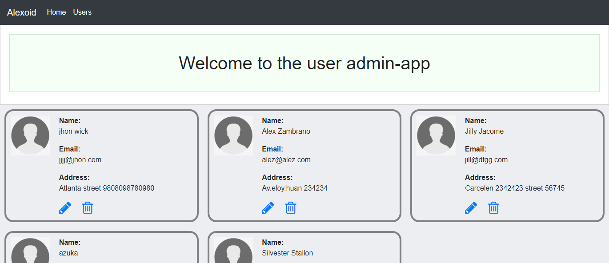
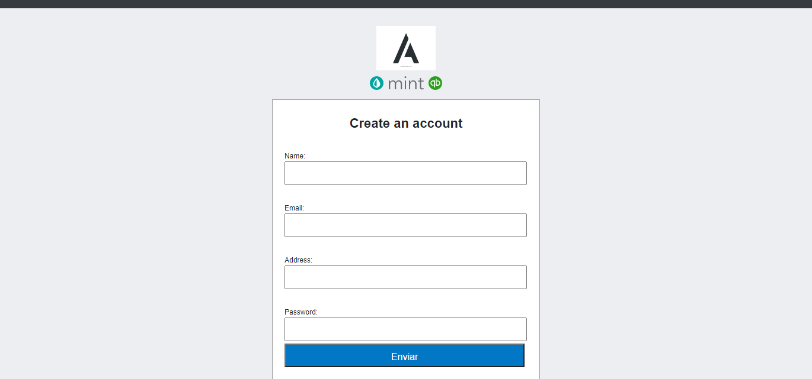

# Users CRUD form

> This a user interface admin with node and my sql

## Built With

- Nodejs 
- Express
- Mysql
- Pug

### Prerequisites

- Browser
- Internet
- Install mysql
- Install npm
- Install node
- Download the code from repository (https://github.com/Alexoid1/Users-CRUD-form-)

## Getting Started

**Navigation bar**

- open terminal 
- type (mysql -u root -p)
- open database/db.sql
- copy all content of the db file in the terminal(mysql shell)
- open a new terminal
- cd in the repo folder
- npm start

👤 **Pablo Alexis Zambrano Coral**

- Github: [@Alexoid1](https://github.com/Alexoid1)
- Twitter: [@pablo_acz](https://twitter.com/pablo_acz)
- Linkedin: [linkedin](https://www.linkedin.com/in/pablo-alexis-zambrano-coral-7a614a189/)

## 🤝 Contributing

Contributions, issues and feature requests and any type of feedback to improve are welcome!

## Show your support

Give a ⭐️ if you like this project!

## 📝 License

This project has no license.
